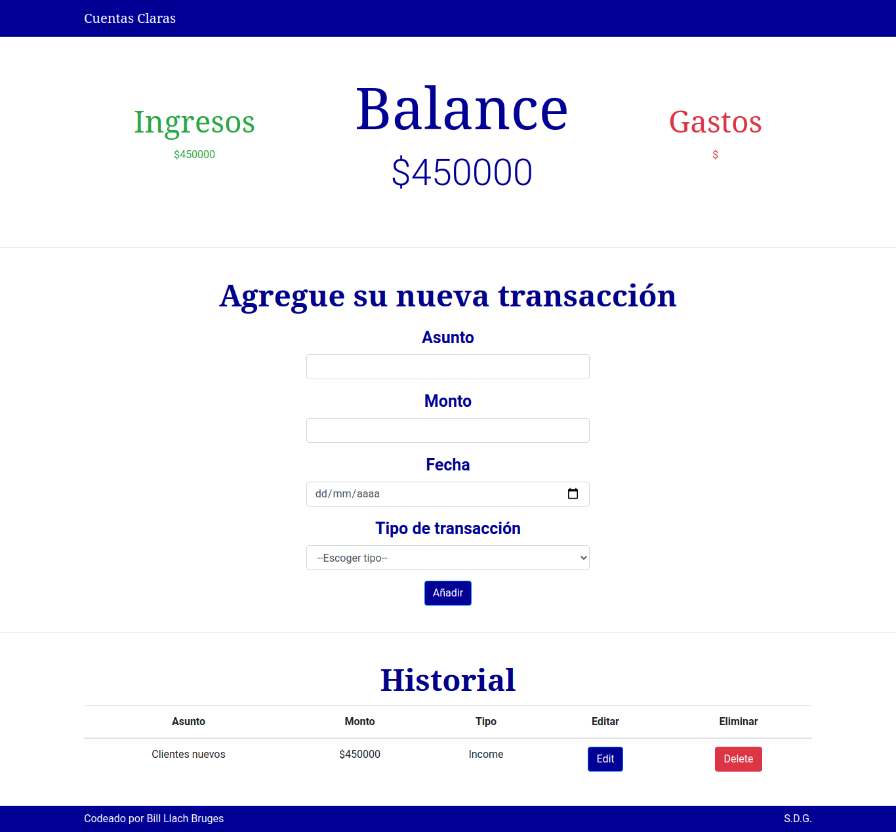

# Cuentas Claras

CRUD app for your personal finances. It is the JS Alkemy Challenge.

## Screenshot

## Built With

* [React JS](https://reactjs.org/) - Frontend framework
* [Node JS](https://nodejs.org/en/) - Backend Language
* [Express](https://expressjs.com/) - Backend framework
* [PostgreSQL](https://www.postgresql.org/) - Relational Database
* [Bootstrap 4](https://getbootstrap.com/) - Frontend framework

## Author

* **Bill Llach Bruges** - [Tony-coder-18](https://github.com/tony-coder-18)
